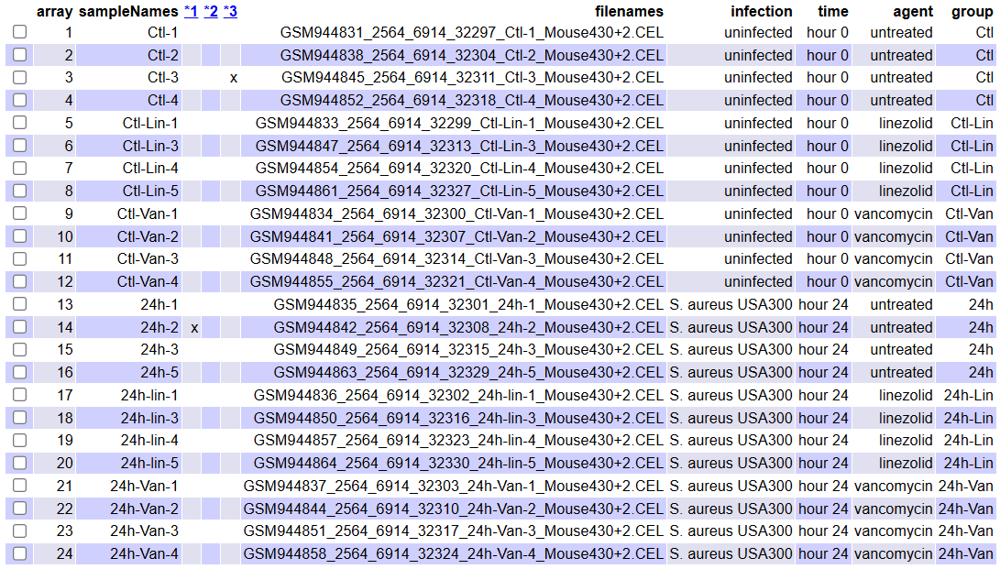
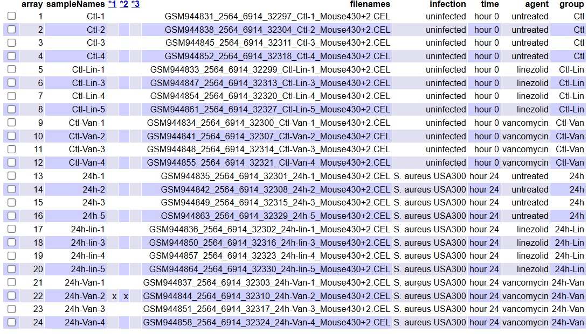

```{r setup, include=FALSE}
knitr::opts_chunk$set(echo = FALSE, message = FALSE, warning = FALSE,
                      cache = TRUE, comment = NA)
```

# 1. Introducción

El estudio https://www.ncbi.nlm.nih.gov/geo/query/acc.cgi?acc=GSE38531 analiza la respuesta inmunológica a infecciones por **Staphylococcus aureus resistente a meticilina (MRSA)** mediante datos de expresión génica obtenidos de un modelo murino (del ratón). Se quieren comparar las condiciones de no infección e infección en presencia o ausencia de los antibióticos linezolid y vancomicina, lo que permite identificar cambios en la expresión génica asociados a cada tratamiento.

El análisis se llevará a cabo en tres etapas principales: preparación de los datos en bruto de expresión y selección de muestras, generación de listas de genes diferencialmente expresados mediante técnicas estadísticas, y caracterización biológica de estos genes mediante Análisis de Enriquecimiento Genético (*Gene Enrichment Analysis*, en inglés) y visualización.

Los resultados proporcionarán una caracterización clara de las diferencias génicas entre las muestras no infectadas e infectadas, no tratadas o tratadas con linezolid o vancomicina. Esto permitirá evaluar el efecto inmunomodulador de ambos antibióticos, identificar rutas biológicas afectadas y obtener una visión general de los mecanismos moleculares subyacentes. La discusión incluye una comparación de los perfiles génicos generados por ambos antibióticos, arrojando luz sobre sus diferencias biológicas y aplicaciones terapéuticas.

# 2. Objetivos del estudio

El objetivo principal de este trabajo es **identificar y caracterizar procesos biológicos relevantes a través del análisis de expresión génica diferencial** en un conjunto de datos transcriptómicos de ratón, integrando herramientas bioinformáticas y métodos estadísticos robustos. Este propósito se desglosa en los siguientes objetivos específicos:

  - Pre-procesar los datos transcriptómicos para **garantizar su calidad**, mediante la normalización y el filtrado basado en criterios de variabilidad y anotación confiable.
  
  - **Identificar genes diferencialmente expresados** en muestras del ratón entre condiciones experimentales (muestras infectadas y no infectadas, sin tratar, tratadas con linezolid o tratadas con vancomicina), utilizando un diseño estadístico adecuado que permita establecer contrastes significativos y evaluar el impacto global de la infección (MRSA).
  
  - **Comparar los perfiles génicos** asociados a las muestras infectadas y no infectadas, sin tratar, tratadas con linezolid o tratadas con vancomicina, identificando similitudes y diferencias en los mecanismos moleculares y rutas biológicas moduladas por estos dos antibióticos.
  
  - Explorar los procesos biológicos enriquecidos asociados a los genes identificados mediante **Análisis de Enriquecimiento Genético** basado en Gene Ontology (GO) y generar representaciones gráficas informativas para visualizar patrones de expresión génica y su relación con procesos biológicos, facilitando la interpretación de resultados.

Estos objetivos buscan no solo alcanzar conclusiones sobre los datos trabajados, sino también establecer un marco analítico reproducible para estudios transcriptómicos similares.

# 3. Materiales y Métodos

En este apartado se describe el conjunto de datos utilizado para el análisis, las herramientas bioinformáticas empleadas y el procedimiento general seguido para procesar y analizar los datos de expresión génica de los ratones.

## 3.1. Origen y selección de los datos

El conjunto de datos utilizado en esta PEC se obtuvo de GEO, descargados directamente desde la web del estudio https://www.ncbi.nlm.nih.gov/geo/query/acc.cgi?acc=GSE38531, con código GEO Serie **GSE38531**. Al final de esta web se encuentran los enlaces para la descarga de los archivos .CEL comprimidos, necesarios para realizar los análisis deseados. Estos archivos deben descomprimirse para obtener cada archivo .CEL único. En nuestro caso, utilizamos un subdirectorio llamado `GSE38531` para guardar todos los archivos .CEL.

Este estudio consta de 35 muestras, de las que tendremos que seleccionar algunas, 15 tomadas antes de la infección (MRSA) y 20 después: 5 de ellas que serán las que eliminaremos, a las 2 horas de la misma y 15 a las 24 horas. La información sobre las muestras nos fueron proporcionados de antemano en un documento llamado `allTargets.txt`, con el nombre de cada muestra, si estaba infectada o no, la hora tras la infección a la que fue tomada cada muestra (las muestras no infectadas a las 0 horas) y el tratamiento que recibieron las muestras (ninguno, linezolid o vancomycin).

Como hemos comentado, estas muestras deben ser seleccionadas, por un lado prescindiremos de las 5 muestras tomadas a las 2 horas y, por otro lado, sortearemos las muestras restantes de forma que conservaremos tan sólo 4 muestras de cada grupo.

La carga de los datos así como la selección de muestras se verán en el apartado 4.1.1.

Para la realización del análisis también es importante saber de qué tipo son los datos para saber qué paquete de anotaciones de Bioconductor tendremos que utilizar. Esta información nos la proporcionará la plataforma con la que se obtubieron los datos. Según el estudio original, se usó la plataforma de microarrays GPL1261	[Mouse430_2] Affymetrix Mouse Genome 430 2.0 Array, por lo que el paquete de anotaciones que tendremos que utilizar es **`mouse4302.db`**.

## 3.2. Herramientas y paquetes utilizados

El informe se llevó a cabo utilizando una variedad de herramientas informáticas y bioinformáticas, principalmente empleando el **lenguaje de programación R**, en su versión 4.3.3, junto con una serie de paquetes de **Bioconductor** específicos para el análisis de datos de microarrays. A continuación, se detallan las herramientas y métodos utilizados en el desarrollo del informe.

Las diferentes librerías y herramientas, tanto de Bioconductor como de R, que se han utilizado a lo largo de esta PEC han sido las instaladas en la siguiente celda de código.

```{r, echo=TRUE, eval=FALSE}
if (!requireNamespace("BiocManager", quietly = TRUE))
  install.packages("BiocManager")

install.packages("dplyr")
install.packages("ggplot2")
install.packages("ggrepel")
install.packages("gplots")
BiocManager::install("Biobase")
BiocManager::install("oligo")
BiocManager::install("arrayQualityMetrics")
BiocManager::install("genefilter")
BiocManager::install("pd.mouse430.2")
BiocManager::install("mouse4302.db")
BiocManager::install("limma")
BiocManager::install("AnnotationDbi")
BiocManager::install("org.Mm.eg.db")
BiocManager::install("clusterProfiler")
BiocManager::install("enrichplot")
```
Estas librerías y herramientas, en resumen, realizan las siguientes funciones:

  - `dplyr`: contiene algunas funciones específicas para la manipulación de *data frames*.
  
  - `ggplot2`, `ggrepel` y `gplots`: contienen funciones para la visualización de datos mediante diferentes tipos de gráficos.
  
  - `Biobase`: proporciona clases y funciones para manejar datos ómicos de experimentos biológicos, especialmente para crear objetos `ExpressionSet` que combinan datos de expresión con información fenotípica.
  
  - `oligo`: se utiliza para la lectura de archivos .CEL, que son los datos en bruto de los microarrays, y para la normalización mediante el algoritmo RMA.
  
  - `limma`: implementa métodos de modelado lineal para analizar datos de expresión diferencial, siendo fundamental para la creación de matrices de diseño y contrastes, así como para la selección de genes diferencialmente expresados.
  
  - `arrayQualityMetrics`: ofrece herramientas para el control de calidad de datos de microarrays, generando informes detallados sobre la calidad de los arrays.
  
  - `genefilter`: se utiliza para el filtrado de genes basado en la variabilidad, ayudando a enfocar el análisis en las sondas más informativas.
  
  - `clusterProfiler` y `enrichplot`: estos paquetes permiten realizar y visualizar, respectivamente, análisis de enriquecimiento genético, ayudando a interpretar los resultados biológicamente.
  
  - `AnnotationDbi` y `org.Mm.eg.db`: facilitan la anotación de genes, mapeando identificadores de genes a sus nombres y otra información biológica relevante.

## 3.3. Procedimiento general de análisis

El procedimiento general de análisis se desarrollará en varias etapas clave, cada una utilizando métodos específicos para garantizar resultados precisos y reproducibles.

Se comenzará con la **preparación de datos**, iniciando con la carga de datos en bruto desde archivos .CEL y la preparación de un objeto `ExpressionSet` que contendrá tanto los datos de expresión como la información fenotípica de las muestras. También re realizará una selección y filtrado inicial de muestras basado en los criterios experimentales predefinidos.

Continuaremos con un **control de calidad mediante análisis exploratorio** y con una posterior **normalización de los datos**. Se llevará a cabo un análisis exploratorio para evaluar la calidad de los datos mediante gráficos de boxplot, densidad, análisis de componentes principales (PC) y clusters jerárquicos. También utilizaremos el paquete `arrayQualityMetrics` para generar un informe de calidad de los arrays. Finalmente, aplicaremos el algoritmo RMA para normalizar los datos, asegurando que las intensidades de las muestras estén en una escala comparable, y repetiremos el control de calidad y el análisis exploratorio.

A continuación, implementaremos un **filtrado de genes** no específicos para eliminar aquellos con baja variabilidad o sin anotaciones relevantes, reduciendo el ruido y enfocando el análisis en sondas informativas, y quedándonos con el 10% de sondas que presenten mayor variabilidad.

El siguiente paso será realizar un **análisis de expresión diferencial**. Para ello, primero se construirán **matrices de diseño y de contrastes** para modelar las comparaciones de interés. Después se ajustará el **modelo lineal** de los datos normalizados y filtrados, y se aplicarán **contrastes** para identificar genes diferencialmente expresados. Además, visualizaremos estos resultados mediante gráficos como **volcano plots y mapas de calor** para visualizar patrones de expresión diferencial.

Por último, realizaremos la **anotación de los genes** y un **análisis de significancia biológica**.
Se anotarán los genes seleccionados para obtener información biológica relevante, como símbolos genéticos y nombres de genes y, después, realizaremos un **Análisis de Enriquecimiento Genético** (*Gene Enrichment Analysis*, en inglés) para identificar procesos biológicos o rutas moleculares enriquecidas en los genes expresados diferencialmente. También se visualizarán estos resultados mediante gráficos de red genética para interpretar los resultados en un contexto biológico.

# 4. Desarrollo del análisis y obtención de resultados

Este es el punto clave del informe y del desarrollo de esta PEC. Dentro de este apartado se desarrollarán todos los pasos necesarios para realizar un anális completo de los datos a estudiar, y obtener unos resultados en consecuencia. 

## 4.1. Preparación de los datos

Comenzaremos esta PEC preparando los datos para la realización de los siguientes apartados. Lo primero que debemos hacer es cargar los datos y seleccionar las muestras de la forma especificada en el enunciado y, una vez hecho esto, proceder a la lectura de los datos en bruto. Nuestro objetivo es crear un objeto de tipo `ExpressionSet` con los datos en bruto y la información de las muestras, con el que desarrollaremos los apartados de la PEC.

Para poder cargar los datos y, al mismo tiempo, asociar a cada muestra los valores correspondientes a sus covariables, se nos ha proporcionado el archivo `allTargets.txt` que contiene la identificación de cada archivo .CEL (es decir, cada muestra) y su asignación a una condición experimental específica, contando un total de 35 muestras. A continuación, procederemos a la carga y selección de las muestras.

### 4.1.1. Carga de los datos y selección de muestras

Para preparar los datos como se nos indica en el enunciado de este apartado de la PEC, en primer lugar, eliminaremos del archivo `allTargets.txt` las cinco muestras tomadas a las dos horas.

```{r}
# Eliminar las muestras tomadas a las 2 horas de "allTargets.txt"

# Cargar el archivo "allTargets.txt"
allTargets <- read.table("allTargets.txt", header = TRUE, sep = " ", stringsAsFactors = FALSE)

# Filtrar las muestras eliminando aquellas que tienen "hour 2" en la columna 'time'
filteredTargets <- allTargets[allTargets$time != "hour 2", ]

# Mostrar la cantidad de muestras eliminadas y las restantes
print("Muestras después de eliminar las que están a las 2 horas:")
print(paste("Muestras originales:", nrow(allTargets)))
print(paste("Muestras restantes:", nrow(filteredTargets)))

# Mostrar la nueva tabla filtrada "filteredTargets"
filteredTargets
```

A continuación, con las muestras restantes (30 muestras) se realizará un sorteo aleatorio mediante el cuál se conservarán tan sólo cuatro muestras de cada combinación de grupos. Este sorteo se realizará mediante la función `selectSamples` proporcionada en el archivo `selectSamples.R`. Esta función extraerá un total de 24 muestras distintas.

Sin embargo, debemos tener en cuenta que, antes de aplicar la función `selectSamples`, tendremos que añadir los nombres de los archivos .CEL al archvo `allTargets.txt`. Así, nos aseguraremos de que al aplicar `selectSamples`, nos proporcionará un nuevo objeto `targets` (valores de las covariables de las muestras seleccionadas) únicamente con aquellos archivos .CEL seleccionados, con el que se podrá crear un `ExpressionSet` personalizado leyendo las 24 muestras seleccionadas. Los archivos .CEL los tenemos descomprimidos en el directorio "GSE38531", dentro de nuestro proyecto, por lo que obtendremos la lista de archivos .CEL de este directorio.

```{r}
# Añadir los nombres de los archivos .CEL a "filteredTargets"

# Obtener la lista de archivos .CEL en la carpeta "GSE38531"
files_cel <-list.files("GSE38531") 

# Extraer los primeros 9 caracteres de los nombres de archivos .CEL
sampleNames <- substr(files_cel, 1, 9) 

# Filtrar solo los archivos cuyos nombres coinciden con los valores en "sample"
matching_files <- files_cel[sampleNames %in% filteredTargets$sample]
matching_sampleNames <- sampleNames[sampleNames %in% filteredTargets$sample]

# Verificar coincidencia entre los nombres de archivos .CEL y las filas de "filteredTargets"
# y unir los nombres de los archivos .CEL a "filteredTargets" creando un nuevo dataframe "targets"
if (length(matching_files) > 0) {
  
  # Reordenar los nombres y archivos .CEL para que coincidan con el orden de "filteredTargets"
  order <- match(filteredTargets$sample, matching_sampleNames)
  # Unir los nombres completos de los archivos al dataframe "targets" en el orden original
  targets <- cbind(
    filenames = matching_files[order],
    filteredTargets)
  
} else {
  # Mensaje de error si no coinciden
  warning("Los nombres de los archivos no coinciden con las muestras del data frame.")
}

# Mostrar el resultado final de "targets"
head(targets)
```

Una vez tenemos el nuevo `targets` con las muestras y los nombres de los archivos .CEL correctos, podemos proceder a aplicar la función `selectSamples` proporcionada en el archivo `selectSamples.R`. Como comentamos antes, el objetivo de aplicar esta función es sortear aleatoriamente las muestras para conservar tan sólo cuatro muestras de cada combinación de grupos *infection* (infección) - *agent* (tratamiento), obteniendo un total de 24 muestras diferentes. Utilizaremos como semilla (argumento `seed`) mi DNI sin la letra.

```{r}
# Aplicar "selectSamples" para obtener 24 muestras de "targets"

# Semilla con mi DNI (sin letra)
seed <- 49218850

# Llamada al archivo "selectSamples.R" y a su función interna "filter_microarray"
source("selectSamples.R")
finalTargets <- filter_microarray(targets, seed)

# Ordenar las muestras de "finalTargets" en el orden original de "allTargets.txt"
finalTargets <- finalTargets[order(as.numeric(sub(".*\\.", "", rownames(finalTargets)))), ]

# Mostrar las dimensiones finales de "finalTargets" y el numero de muestras por
# combinación "infection" (infección) - "agent" (tratamiento)
print(paste("Muestras finales:", nrow(finalTargets)))
print("Muestras para cada combinación infection (infección) - agent (tratamiento):")
table(finalTargets$infection, finalTargets$agent)
```

Para terminar de preparar los datos, dentro del archivo `finalTargets` debemos crear dos columnas adicionales que nos ayudarán a trabajar y analizar más fácilmente los datos en bruto, que leeremos después. Estas columnas se llamarán *shortName* y *group*.

Por un lado, *shortName* obtendrá un nombre corto (como el nombre de la columna indica, en inglés) de los nombres de los archivos .CEL, por ejemplo, "GSM944833_2564_6914_32299_Ctl-Lin-1_Mouse430+2.CEL" será en *shortName* "Ctl-Lin-1".

Por otro lado, *group* será de tipo factor y creará grupos según las combinaciones ontenidas en la tabla de muestras anterior. Para las muestras cuya columna *infected* indica "uninfected", el grupo se nombrará comenzando con "Ctl", y si indica "S. aureus USA300", el grupo se nombrará comenzando con "24h", puesto que todas las muestras que presentaban infección eran tomadas a las 24 horas de infectarse (recordamos que aquellas que se tomaron a las 2 horas de infectarse fueron eliminadas). Además, para las muestras cuya columna *agent* indica "untreated", su grupo sólo se basará en su columna *infected* puesto que no recibe tratamiento, mientras que si indica "linezolid" o "vancomycin", su grupo se nombrará finalizando con un guión y "Lin" o "Van", respectivamente. Por ejemplo, si para una muestra su columna *infected* indica "uninfected" y su columna *agent* indica "linezolid", el nombre de su grupo será "Ctl-Lin".

Mostraremos el archivo final `finalTargets` para comprobar que estas nuevas variables se han añadido correctamente y para ver las 24 muestras que se seleccionaron.

```{r}
library(dplyr)

# Crear las columnas "shortName" y "group" en el archivo "finalTargets"
finalTargets <- finalTargets %>%
  mutate(
    # Crear "shortName" extrayendo el nombre entre el último guion bajo y ".CEL"
    shortName = sub(".*_(.*?)_Mouse430\\+2\\.CEL", "\\1", filenames),
    
    # Crear "group", de tipo factor, según las combinaciones de "infection" y "agent"
    group = factor(case_when(
      infection == "uninfected" & agent == "untreated" ~ "Ctl",
      infection == "uninfected" & agent == "linezolid" ~ "Ctl-Lin",
      infection == "uninfected" & agent == "vancomycin" ~ "Ctl-Van",
      infection == "S. aureus USA300" & agent == "untreated" ~ "24h",
      infection == "S. aureus USA300" & agent == "linezolid" ~ "24h-Lin",
      infection == "S. aureus USA300" & agent == "vancomycin" ~ "24h-Van",
      TRUE ~ NA_character_ # Valores predeterminados como NA
    ), levels = c("Ctl", "Ctl-Lin", "Ctl-Van", "24h", "24h-Lin", "24h-Van"))
  )

# Mostrar el archivo "finalTargets" modificado y con las muestras seleccionadas
finalTargets

```

### 4.1.2. Lectura de datos en bruto (archivos .CEL)

Una vez que hemos obtenido correctamente las muestras que necesitamos y hemos añadido los datos necesarios en `finalTargets`, el siguiente paso es leer los datos en bruto a partir de los archivos .CEL. Para ello, crearemos un objeto de tipo `ExpressionSet` para poder combinar la información del archivo `finalTargets` con los datos en bruto de los archivos .CEL.

Para crear este objeto, en primer lugar utilizaremos la función `annotatedDataFrame` del paquete `Biobase` de Bioconductor para crear un objeto de este mismo tipo con los datos de `finalTargets`. A este nuevo objeto lo llamaremos `dataTargets`. Se adjunta el código para que se aprecie, puesto que no se muestra ninguna salida.

```{r echo=TRUE}
library(Biobase)

# Crear objeto de tipo "AnnotatedDataFrame" de "finalTargets"
dataTargets <- AnnotatedDataFrame(finalTargets)
```

A partir de este nuevo objeto `dataTargets` podemos crear el `ExpressionSet` con este objeto y los datos en bruto. Para ello, leeremos y almacenaremos los datos en bruto de los archivos .CEL en una variable que llamaremos `rawData`. Esta variable será el objeto `ExpressionSet` y lo crearemos mediante la función `read.celfiles` del paquete `oligo` de Bioconductor.

```{r}
library(oligo)

# Obtener las rutas de los archivos .CEL correspondientes a las muestras seleccionadas
celFiles <- paste0("GSE38531/", pData(dataTargets)$filenames)

# Crear el objeto ExpressionSet con los datos en bruto de los archivos .CEL y los datos
# de "dataTargets"
rawData <- read.celfiles(celFiles, phenoData = dataTargets)

```

Además, para facilitar la identificación de las muestras, cambiaremos los nombres de cada fila de `dataTargets` (cada muestra) por su nombre creado en la columna *shortName* y mostraremos la información de estos datos en bruto.

```{r}
# Modificar nombres de las muestras por su "shortName" del objeto "dataTargets"
rownames(pData(rawData)) <- dataTargets$shortName
colnames(rawData) <-rownames(pData(rawData))

# Mostrar la información sobre los datos en bruto "rawData"
show(rawData)
```

## 4.2. Análisis exploratorio y control de calidad

Una vez obtenidos los datos en bruto de los archivos .CEL y creado el `ExpressionSet`, continuaremos la realización de esta PEC realizando un análisis exploratorio de los datos y un control de calidad de los mismo. El objetivo es explorar los datos seleccionados para identificar patrones generales, evaluar la calidad de las muestras y detectar posibles problemas con los datos antes de realizar un análisis más detallado. Además, tendremos que normalizar los datos para que los resultados de apartados posteriores sean correctos y adecuados.

### 4.2.1. Análisis exploratorio y visualización de los datos en bruto

Comenzaremos la exploración de los datos con un **análisis univariante** que incluirá diagramas de caja (*Boxplot*) y diagramas de densidad de la señal de las muestras seleccionadas.

Para que la visualización de los datos mediante gráficos sea más intuitiva, asignaremos a cada uno de los grupos de `rawData` un color representativo en la variable `colors`. Para las muestras pertenecientes al grupo `Ctl` su color será el rojo, para las muestras pertenecientes al grupo `Ctl-Lin` su color será el amarillo, para las muestras pertenecientes al grupo `Ctl-Van` su color será el azul, para las muestras pertenecientes al grupo `24h` su color será el verde, para las muestras pertenecientes al grupo `24h-Lin` su color será el naranja y para las muestras pertenecientes al grupo `24h-Van` su color será el morado.

```{r}
# Asignar colores a los grupos
colors <- c(rep("red",4), rep("yellow",4), rep("blue",4),
            rep("green",4), rep("orange",4), rep("purple",4))
```

Comenzamos realizando los **diagramas de caja o *Boxplots*** de los datos en `rawData`.

```{r}
# Boxplots de los datos en bruto de "rawData"
boxplot(rawData, col = colors, names = dataTargets$shortName,
        main="Distribución de intensidad de los datos en bruto",
        las=2, cex.axis=0.8)
```

A continuación, realizamos el **diagrama de densidad** de la señal de las muestras seleccionadas en `rawData`. 

```{r}
# Diagrama de densidad de la señal de las muestras en "rawData"
hist(rawData, col = colors, lty =1:nrow(pData(rawData)),
     main ="Densidad de la señal de las muestras en bruto")

# Leyenda para el diagrama de densidad
legend(x ="topright",legend = dataTargets$shortName, col = colors,
       lty =1:nrow(pData(rawData)), cex =0.5)
```

Tanto los diagramas de cajas (*Boxplots*) como el diagrama de densidad de la señal de los datos en bruto `rawData` muestran que la distribución de las intensidades de las muestras son bastante similares en cuanto a cantidad, pero sus posiciones son ligeramente asimétricas, por lo que existe cierta variación en la intensidad de las muestras, lo que sugiere que se debe realizar algún tipo de normalización en los datos para centrarlos dentro de una misma escala.

Vamos a continuar la exploración de los datos con un **análisis multivariante** que incluirá un análisis y gráfico de las componentes principales (PC) de los datos y un diagrama jerárquico, para representar la separación entre grupos.

Realizamos, en primer lugar, el **análisis** y el **gráfico de las componentes principales (PC)** para los datos en bruto.

```{r}
# Análisis de las componentes principales de "rawData"
pc <- prcomp(t(exprs(rawData)), scale. = FALSE)
summary(pc)
```

El análisis de componentes principales (PC) nos indica que la primera componente (PC1) nos explica más del 37% de la variabilidad de los datos y que no se explica más de un 80% de la variabilidad de los datos hasta la componente 5 (PC5), por lo que es posible encontrar un pequeño efecto *batch* en los datos, pero lo comprobaremos mejor cuando realicemos el gráfico. También podemos observar que se explica el 100% de la variabilidad de los datos en la componente 23 (PC23), por lo que la última componente (PC24) no aporta variabilidad adicional porque tiene una desviación estándar cercana a cero.

Realicemos ahora el gráfico. Para la realización de este gráfico de componentes principales (PC), utilizaremos una función diseñada específicamente para ello, obtenida directamente de la bibliografía. A raíz de esta función, obtendremos el gráfico correspondiente.

```{r}
library(ggplot2)
library(ggrepel)

# Crear función para realizar el gráfico de las componentes principales (PC)
plotPCA <- function (datos, labels, factor, title, scale,colores, size = 1.5, glineas = 0.25) {
  data <- prcomp(t(datos),scale=scale)
  #Ajustes del gráfico
  dataDf <- data.frame(data$x)
  Group <- factor
  loads <- round(data$sdev^2/sum(data$sdev^2)*100,1)
  # Gráfico principal
  p1 <- ggplot(dataDf,aes(x=PC1, y=PC2)) +
    theme_classic() +
    geom_hline(yintercept = 0, color = "gray70") +
    geom_vline(xintercept = 0, color = "gray70") +
    geom_point(aes(color = Group), alpha = 0.55, size = 3) +
    coord_cartesian(xlim = c(min(data$x[,1])-5,max(data$x[,1])+5)) +
    scale_fill_discrete(name = "Group")
  # Evitar superposición de etiquetas
  p1 + geom_text_repel(aes(y = PC2 + 0.25, label = labels),segment.size = 0.25, size = size) +
    labs(x = c(paste("PC1",loads[1],"%")),y=c(paste("PC2",loads[2],"%"))) +
    ggtitle(paste("Principal Component Analysis for: ",title,sep=" ")) +
    theme(plot.title = element_text(hjust = 0.5)) +
    scale_color_manual(values=colores)
}
```

```{r}
# Crear el gráfico de componentes principales de "rawData" a partir de la función
plotPCA(exprs(rawData), labels = dataTargets$shortName, factor = dataTargets$group,
        title="rawData", scale = FALSE, size = 3,
        colores = c("red", "yellow", "blue", "green", "orange", "purple"))
```

Como hemos puntualizado anteriormente, la primera componente principal (PC1) repesenta el 37,7% de la variabilidad total de los datos, y como podemos observar en el gráfico de los datos en bruto en las dos primeras componentes principales, esta variabilidad está principalmente atribuida a la condición de **infección** (*infection*), ya que las muestras que no han sido infectadas con S. aureus USA300 (es decir, tomadas a las 0 horas de la infección) están a la izquierda del gráfico, mientras que las muestras que sí han sido infectadas con S. aureus USA300 (es decir, tomadas a las 24 horas de la infección) están a la derecha del gráfico. Sin embargo, es posible que exista un pequeño efecto *batch* dado que hay algunas muestras de diferentes grupos de infección que están en el centro del gráfico.

Vamos a realizar el **diagrama o clúster jerárquico** para confirmar o desmentir esta teoría y ver más adecuadamente la separación entre grupos de los datos en bruto.

```{r}
# Cálculo de las distancias y composición del cluster
dist_clust <- hclust(dist(t(exprs(rawData))), method = "average")

# Cluster jerárquico de los datos en bruto "rawData"
plot(dist_clust, labels = dataTargets$shortName, hang = -1, xlab = "Distancia euclídea",
     main = "Clúster jerárquico de los datos en bruto",)
```

El diagrama o clúster jerárquico nos muestra una **clara separación** entre los grupos que presentan infección de S. aureus USA300 (a las 24 horas) y aquellos que no presentan infección, por lo que no tenemos un claro efecto *batch* que debiésemos eliminar. Además, las muestras `24h-2` y `24h-2` se separan de todas las demás, por lo que podrían ser eliminadas del análisis, sin embargo, no las eliminaremos para tener un análisis más completo.

### 4.2.2. Control de calidad de los datos en bruto

Para realizar el control de calidad de los datos en bruto `rawData` que nos indica el enunciado de este apartado, vamos a utilizar el paquete `arrayQualityMetrics`. Este paquete contiene los diferentes tipos de análisis exploratorios que hemos realizado hasta ahora, como, por ejemplo, los diagramas de cajas o *Boxplots* o el análisis de componentes principales (PC), entre otros. Así, se pueden ejecutar varios tipos de análisis diferentes de manera más sencilla y rápida. Para realizar este control de calidad, utilizaremos la función `arrayQualityMetrics` del paquete del mismo nombre antes mencionado. Esta función realizará todos los análisis, generando un informe con los resultados obtenidos y posibles problemas detectados.

Al ejecutar la función `arrayQualityMetrics`, le indicaremos que el informe del control de calidad generado se guarde en un subdirectorio de nombre `arrayQualityMetrics_PEC2` para facilitar su búsqueda en el directorio principal. También indicaremos mediante el parámetro `intgroup` que se utilice el factor infección o *infection* como separador de colores en los gráficos, puesto que hemos visto en el partado anterior que este es el factor que produce la mayor diferencia entre las muestras.

El informe generado dentro de este subdirectorio se nombra automáticamente como `index.html`, y dentro del mismo se encuentran todos los análisis y resultados generados por la función `arrayQualityMetrics`.

```{r}
# Control de calidad de los datos en bruto
library(arrayQualityMetrics)
arrayQualityMetrics(rawData, outdir = "arrayQualityMetrics_PEC2",
                    force = TRUE, intgroup = "infection")
```

Una de las primeras cosas que encontramos en el informe `index.html` es una tabla con unas columnas denominadas como `*1`, `*2` y `*3`. Estas columnas indican algunos criterios de calidad que deben ser verificados para comprobar que los arrays son de "buena calidad". En nuestro caso, se han marcado sólo dos muestras una vez. Normalmente cuando sólo hay una marca significa que los problemas o *outliers* potenciales son pequeños por lo que no hace falta eliminar estos arrays. Para nuestro análisis, podemos decidir mantener todos los arrays. A continuación mostramos la tabla en cuestión obtenida en el informe `index.html`.

{width="500px" height="auto"}

### 4.2.3. Análisis de efecto batch de los datos en bruto

Como hemos analizado en el apartado 4.2.1, no hemos detectado un efecto *batch* preocupante en los datos puesto que podemos apreciar una clara separación atribuida a la condición de **infección** (*infection*), la cuál se muestra como la principal fuente de variabilidad en las muestras. Las muestras no infectadas están divididas en un grupo totalmente separado de las muestras infectadas con S. aureus USA300, lo que implica que existen diferencias demostrables entre ambos grupos y que este factor (la infección) no se cruza con el factor tratamiento o *agent*.

Si realizamos un **análisis basado en diatancias**, podremos ver como estas conclusiones son correctas. Calcularemos la matriz de distancias y la visualizaremos mediante un mapa de colores o *heatmap*.

```{r}
# Heatmap basado en diatancias de los datos en bruto
man_dist <- dist(t(exprs(rawData)))
heatmap(as.matrix(man_dist), col = heat.colors(16))
```

Efectivamente, confirmamos que no se aprecia un efecto *batch* y que, por lo tanto, no hay que eliminarlo.

### 4.2.4. Normalización de los datos en bruto

Una vez hemos realizado el análisis exploratorio y el control de calidad de los datos en bruto `rawData`, y hemos concluido además que los datos presentan una ligera asimetría, lo que indica que existe cierta variación en la intensidad de las muestras, debemos proceder a realizar una **normalización de los datos**. Esto es importante porque, para realizar el análisis de expresión diferencial, es necesario hacer que las muestras sean comparables entre sí e intentar reducir y, si es posible eliminar, toda la variabilidad en las muestras que no se deba a razones biológicas, ya que lo que nos interesará descubrir en los siguientes apartados son las diferencias de intensidad que reflejen únicamente la expresión diferencial de los genes, y no otras cuestiones.

Como en el enunciado del apartado nos indica que utilicemos el algoritmo RMA, normalizaremos los datos en bruto mediante la función `rma` obtenida del paquete `oligo`, que utilizamos para leer los datos en bruto. Los datos normalizados seguirán siendo un objeto del tipo `ExpressionSet`, como comprobamos al mostrar su información general.

```{r}
# Normalización de los datos en bruto "rawData" mediante el paquete "oligo"
library(oligo)
esetData_rma <- oligo::rma(rawData)
esetData_rma
```

### 4.2.5. Análisis exploratorio y visualización de los datos normalizados

Una vez que ya tenemos los datos normalizados en un nuevo objeto de tipo `ExpressionSet` llamado `esetData_rma`, vamos a realizar el mismo análisis exploratorio que realizamos para los datos en bruto en el apartado 4.2.1, para comprobar que la intensidad de los datos normalizados ya no presenta la asimetría que presentaban los datos en bruto.

Como hicimos anteriormente, comenzaremos con el **análisis univariante** que incluye los **diagramas de caja (*Boxplot*)** y el **diagrama de densidad** de la señal de las muestras normalizadas.

```{r}
# Boxplots de los datos normalizados "esetData_rma"
boxplot(esetData_rma, col = colors, names = dataTargets$shortName,
        main="Distribución de intensidad de los datos normalizados",
        las=2, cex.axis=0.8)
```

```{r}
# Diagrama de densidad de la señal de las muestras normalizadas en "esetData_rma"
hist(esetData_rma, col = colors, lty =1:nrow(pData(esetData_rma)),
     main ="Densidad de la señal de las muestras normalizadas")

# Leyenda para el diagrama de densidad
legend(x ="topright",legend = dataTargets$shortName, col = colors,
       lty =1:nrow(pData(esetData_rma)), cex =0.5)
```

Como podemos ver tanto en los diagramas de cajas (*Boxplots*) como en el diagrama de densidad de la señal de los datos normalizados, ya no presentan la asimetría que mostraban los datos en bruto y que se ha mitigado la variación en la intensidad de las muestras, por lo que podemos decir que los datos se han normalizado y escalado correctamente.

Si realizamos el **análisis multivariante** con los datos normalizados, realizando de nuevo un **análisis y gráfico de las componentes principales (PC)** y un **diagrama jerárquico** para representar la separación entre grupos, obtenemos los siguientes resultados.

```{r}
# Análisis de las componentes principales de los datos normalizados "esetData_rma"
pc <- prcomp(t(exprs(esetData_rma)), scale. = FALSE)
summary(pc)
```

En este caso, el análisis de componentes principales (PC) nos indica que la primera componente (PC1) nos explica más del 45% de la variabilidad de los datos, es decir, ha aumentado en comparación con los datos en bruto, y que no se explica más de un 80% de la variabilidad de los datos hasta la componente 6 (PC6) en este caso. Igual que en el caso anterior, se explica el 100% de la variabilidad de los datos en la componente 23 (PC23), por lo que la última componente (PC24) no aporta variabilidad adicional porque tiene una desviación estándar cercana a cero.

Observemos el gráfico de componentes principales (PC) de los datos normalizados a continuación.

```{r}
# Crear el gráfico de componentes principales de "esetData_rma" a partir de la función
plotPCA(exprs(esetData_rma), labels = dataTargets$shortName, factor = dataTargets$group,
        title="esetData_rma", scale = FALSE, size = 3,
        colores = c("red", "yellow", "blue", "green", "orange", "purple"))
```

La primera componente principal (PC1) repesenta ahora el 45,7% de la variabilidad total de los datos, por lo que ha aumentado considerablemente y como podemos observar en el gráfico de los datos normalizados en las dos primeras componentes principales, esta variabilidad sigue estando principalmente atribuida a la condición de **infección** (*infection*). De hecho, ahora se puede apreciar mucho mejor la separación entre las muestras que no han sido infectadas con S. aureus USA300 (es decir, tomadas a las 0 horas de la infección) que están a la izquierda del gráfico, y las muestras que sí han sido infectadas con S. aureus USA300 (es decir, tomadas a las 24 horas de la infección) están a la derecha del gráfico. Podemos decir que las muestras normalizadas no muestran ningún tipo de efecto *batch* dado que ahora todas las muestras están completamente separadás según su tipo de infección.

Vamos a corroborar esto mediante el diagrama o clúster jerárquico.

```{r}
# Cálculo de las distancias y composición del cluster
dist_clust1 <- hclust(dist(t(exprs(esetData_rma))), method = "average")

# Cluster jerárquico de los datos en bruto "rawData"
plot(dist_clust1, labels = dataTargets$shortName, hang = -1, xlab = "Distancia euclídea",
     main = "Clúster jerárquico de los datos normalizados",)
```

Efectivamente, el diagrama o clúster jerárquico nos muestra una **clara separación** entre los grupos que presentan infección de S. aureus USA300 (a las 24 horas) y aquellos que no presentan infección, por lo que no tenemos efecto *batch*. Además, las muestras `24h-2` y `24h-2` ya no están separadas de las demás, están unidas a su grupo de infección y ya no haría falta plantear su eliminación.

### 4.2.6. Control de calidad de los datos normalizados

Vamos a realizar un nuevo **control de calidad**, pero esta vez de los **datos normalizados** `esetData_rma`, de la misma manera que hicimos en el apartado 4.2.2, ejecutando la función `arrayQualityMetrics`, e indicado esta vez que el informe del control de calidad generado se guarde en un subdirectorio de nombre `arrayQualityMetrics_Norm_PEC2`. También indicaremos mediante el parámetro `intgroup` que se utilice el factor infección o *infection* como separador de colores en los gráficos.

```{r}
# Control de calidad de los datos normalizados
library(arrayQualityMetrics)
arrayQualityMetrics(esetData_rma, outdir = "arrayQualityMetrics_Norm_PEC2",
                    force = TRUE, intgroup = "infection")
```

En este caso, la tabla del informe `index.html` generado solo muestra una muestra marcada, aunque dos veces esta vez. Sin embargo, esto no indica que haya que eliminar el array puesto que los diagramas del apartado anterior indican que esta muestra está relacionadas con las demás de su grupo, por lo que estos posibles problemas o *outliers* potenciales deben ser pequeños, por lo que no hace falta eliminar este array. Para nuestro análisis, decidirmos mantener todos los arrays.

{width="500px" height="auto"}

## 4.3. Filtrado de los datos

En este apartado vamos a realizar un filtraje no específico de los datos que hemos normalizado en el apartado 4.2.4, `esetData_rma`. El objetivo de este filtraje es eliminar aquellos genes o aquellos *spots* cuyas imágenes o señales sean erróneas por diferentes motivos, con el fin de reducir el ruído de fondo. Este proceso ayudará a enfocar el análisis en aquellas sondas cuyos niveles de expresión varían más entre las muestras, asumiendo que las sondas con baja variabilidad no aportan mucha información biológicamente relevante, o que no existe una anotación específica para esos genes.

Para realizar el filtrado de los datos, utilizaremos la función `nsFilter` del paquete `genefilter` de Bioconductor. Esta función elimina genes en función de un umbral de variabilidad, y en este caso, el enunciado nos indica que nos quedemos con el 10% de sondas que presenten mayor variabilidad, por lo que el umbral `var.cutoff` que tendremos que indicar será del 0,9, es decir, eliminaremos el 90% de las sondas menos variables.

Si hay un paquete de anotaciones disponible (que asocie identificadores de conjuntos de sondas e identificadores de genes de diferentes bases de datos), también se puede utilizar para eliminar conjuntos de sondas que no tengan un identificador de gen asociado. En nuestro caso, nuestro objeto `esetData_rma` sí que disponía de un paquete de anotaciones, concretamente `pd.mouse430.2`, sin embargo, la base datos de anotaciones correcta para este paquete es `mouse4302.db`, por lo que tendremos que modificar el campo `annotation` de `esetData_rma` por esta base de datos para que la función `nsFilter` pueda filtrar con el parámetro `require.entrez = TRUE` y se rellenen las anotaciones (`annotation`) con `mouse4302.db`. Este parámetro lo que nos permitirá es eliminar aquellos genes que no tengan identificador en la base de datos `Entrez`, para poder obtener sólo el 10% de sondas que presenten mayor variabilidad de las que sí tengan identificador en la base de datos.

```{r}
library(genefilter)
library(mouse4302.db)

# Modificación de las anotaciones de "esetData_rma" por la base de datos "mouse4302.db"
annotation(esetData_rma) <- "mouse4302.db"

# Filtrado de los datos normalizados "esetData_rma"

filtered <- nsFilter(esetData_rma,
                     require.entrez = TRUE, # Requerir que las sondas tengan ID Entrez
                     remove.dupEntrez = TRUE, # Eliminar duplicados basados en ID Entrez
                     var.filter = TRUE,  # Activa el filtrado por variabilidad
                     var.func = IQR, # Función estadística de filtrado por función
                     var.cutoff = 0.90,  # Elige el 10% superior (umbral: 90% menos variable)
                     # var.cutoff es un cuantil de todos los valores de var.func
                     filterByQuantile = TRUE, 
                     feature.exclude = "^AFFX" # Excluir sondas de control Affymetrix
)
```

La función `nsFilter` devuelve un objeto de tipo `ExpressionSet` con los valores filtrados y un informe de los resultados del filtrado llamado `filter.log`.

```{r}
# Objetos devueltos por la función "nsFilter"
names(filtered)
```

Comprobemos que los valores filtrados son, efectivamente, un objeto `ExpressionSet` y la información contenida en este objeto.

```{r}
# Clase del objeto "eset" devuelto por la función "nsFilter"
class(filtered$eset)

# Información del objeto "eset"
filtered$eset
```

En cuanto al informe de los resultados, `filter.log`, este tiene la siguiente estructura e información.

```{r}
# Contenido del informe de filtrado devuelto por la función "nsFilter"
print(filtered$filter.log)
```

El informe del filtrado nos indica que, de las 45101 *features* iniciales que había en el objeto `esetData_rma`, se han eliminado 16958 sondas por estar duplicadas según el identificador EntrezID (`numDupsRemoved`), se han eliminado 18442 sondas por tener baja variabilidad en los datos (`numLowVar`), se han eliminado 7639 sondas porque no tenían un ID Entrez asociado (`numRemoved.ENTREZID`) y también se han eliminado otras 13 sondas porque coincidían con el patrón definido en `feature.exclude`, es decir,  las sondas cuyo identificador comenzaba con `"^AFFX"` (sondas de control usadas por Affymetrix).

Todo esto nos deja con un **total de 2049 *features* o genes** anotados que tienen la mayor variabilidad, y será con los que se realizarán los análisis de genes diferencialmente expresados.

Para finalizar este apartado, en primer lugar almacenaremos los genes restantes en la variable `esetData_filtered` de la siguiente manera (adjunto el código para que se aprecie, puesto que no se muestra ninguna salida).

```{r echo=TRUE}
# Almacenar genes filtrados en "esetData_filtered"
esetData_filtered <-filtered$eset
```

Y, en segundo y último lugar, vamos a guardar, en un subdirectorio llamado `results`, los objetos normalizados y filtrados, `esetData_rma` y `esetData_filtered`, respectivamente, en un archivo binario al que llamaremos `normalized.filtered.Data.Rda`, para hacer uso de estos datos en futuros análisis, si fuera necesario. También guardaremos (en el mismo subdirectorio) los valores de expresión, tanto de los datos normalizados como de los datos filtrados, en archivos .csv, de nombres `normalized.Data.csv` y `filtered.Data.csv`, respectivamente.

```{r}
# Guardar los datos de "esetData_rma" y "esetData_filtered"
save(esetData_rma, esetData_filtered, file="./results/normalized.filtered.Data.Rda")

# Guardar los valores de expresión de "esetData_rma" en un archivo .csv
write.csv(exprs(esetData_rma), file="./results/normalized.Data.csv")

# Guardar los valores de expresión de "esetData_filtered" en un archivo .csv
write.csv(exprs(esetData_filtered), file="./results/filtered.Data.csv")
```

## 4.4. Construcción de las matrices de diseño y de contrastes

En este apartado vamos a realizar las matrices de diseño y de contrastes que utilizaremos para llevar a cabo las comparaciones propuestas que son:

  - Infectados vs no infectados sin tratamiento.
  - Infectados vs no infectados tratados con LINEZOLID.
  - Infectados vs no infectados tratados con VANCOMICINA.
  
Estas comparaciones generarán tres listas de genes que tendremos que, por un lado, caracterizar mediante análisis de significación biológica y, por otro lado, comparar entre ellas. El objetivo final es intentar caracterizar, a través del cambio en la expresión génica, el efecto de la infección y del tratamiento con antibióticos así como comparar los efectos de éstos. Para ello, se utilizará el método de Modelos Lineales para Microarrays presentado por Smyth (2004), implementado en el paquete `limma`, para seleccionar genes expresados diferencialmente. Pero esto se hará en apartados posteriores.

Pero por el momento, nos centraremos en los primeros pasos para el análisis basado en modelos lineales es crear la matriz de diseño y la matriz de contrastes.

### 4.4.1. Matriz de diseño

La **matriz de diseño** es una tabla que describe la asignación de cada muestra a un grupo o condición experimental. Esta tabla asigna un 1 a cada muestra dentro del grupo específico al que pertenece, y un 0 a las demás. Las filas de esta tabla son las muestras analizadas, mientras que las columnas representan los diferentes grupos.

La matriz de diseño puede configurarse de manera manual o generarse a partir de una variable factorial incluida en los `targets` creado para tal fin. Recordamos que, en el apartado 4.1.1 ya creamos esta variable factorial que se incluyó en el archivo `dataTargets` y que denominamos *group*. También recordaremos que esta variable representa la combinación de las dos condiciones experimentales que nos interesan en el estudio, *infection* ("uninfected" y "S. aureus USA300") y *agent* ("untreated", "linezolid" y "vancomycin"), las cuales se integran como un factor con seis niveles.

Es importante recordar también cómo se configuró esta variable *group*, puesto que utilizaremos las mismas denominaciones a la hora de realizar tanto la matriz de diseño como la de contrastes:

  - Para las muestras cuya columna *infected* indica "uninfected", el grupo se nombrará comenzando con "Ctl", y si indica "S. aureus USA300", el grupo se nombrará comenzando con "24h", puesto que todas las muestras que presentaban infección eran tomadas a las 24 horas de infectarse (recordamos que aquellas que se tomaron a las 2 horas de infectarse fueron eliminadas). Además, para las muestras cuya columna *agent* indica "untreated", su grupo sólo se basará en su columna *infected* puesto que no recibe tratamiento, mientras que si indica "linezolid" o "vancomycin", su grupo se nombrará finalizando con un guión y "Lin" o "Van", respectivamente. Por ejemplo, si para una muestra su columna *infected* indica "uninfected" y su columna *agent* indica "linezolid", el nombre de su grupo será "Ctl-Lin".
  
Sin embargo, para evitar errores con los grupos denominados con "24h" a la hora de realizar la matriz de contrastes (puesto que lo reconoce como un número y no como un nombre), cambiaremos la denominación "24h" por **"inf24h"** en las matrices. También utilizaremos **puntos** en vez de guiones.
  
Creamos, a continuación, la matriz de diseño con la función `model.matrix` y la variable factorial *group* de los datos filtrados en el apartado 4.3, `esetData_filtered`.
  
```{r}
# Matriz de diseño de "esetData_filtered"
design_matrix <- model.matrix(~0+group, pData(esetData_filtered))
colnames(design_matrix) <- c("Ctl", "Ctl.Lin", "Ctl.Van", "inf24h", "inf24h.Lin", "inf24h.Van")
print(design_matrix)
```

### 4.4.2. Matriz de contrastes

Una vez obtenida la matriz de diseño, podemos pasar a obtener la **matriz de contrastes**. Recordamos que son tres las comparaciones que queremos hacer (definidas al inicio del apartado 4.4), lo que equivale a tres contrastes.

La matriz de contrastes se emplea para representar las comparaciones entre distintos grupos de interés. Su estructura consta de un número de columnas igual al de comparaciones a realizar realizadas y de filas equivalentes a los grupos o columnas de la matriz de diseño. Cada comparación entre grupos, denominada "contraste", se expresa mediante un 1 y un -1 en las filas correspondientes a los grupos en comparación, mientras que las demás filas se completan con 0. En caso de incluir varios grupos en una comparación, se asignan tantos coeficientes como grupos involucrados, con la única condición de que la suma de estos coeficientes sea igual a cero.

Para realizar la matriz de contrastes utilizaremos la función `makeContrasts` del paquete `limma` de Bioconductor. Los grupos a contrastar se definirían de la siguiente manera, según las comparaciones que nos indica el enunciado:

  - Infectados vs no infectados sin tratamiento = inf24h vs Ctl.
  - Infectados vs no infectados tratados con LINEZOLID = inf24h-Lin vs Ctl-Lin.
  - Infectados vs no infectados tratados con VANCOMICINA = inf24h-Van vs Ctl-Van.
  
```{r}
library(limma)

# Matriz de contrastes
cont_matrix <- makeContrasts (inf24h_vs_Ctl = inf24h - Ctl,
                              inf24h.Lin_vs_Ctl.Lin = inf24h.Lin - Ctl.Lin,
                              inf24h.Van_vs_Ctl.Van = inf24h.Van - Ctl.Van,
                              levels = design_matrix)

print(cont_matrix)
```

## 4.5. Obtención de las listas de genes diferencialmente expresados para cada comparación

En este apartado, y una vez definidas la matriz de diseño y la matriz de contrastes, en primer lugar procederemos a estimar el modelo lineal para microarrays necesario, implementado en el paquete `limma` de Bioconductor, y estimar los contrastes para seleccionar los genes expresados diferencialmente. A continuación, obtendremos listas de genes expresados diferencialmente para cada comparación y visualizaremos esta expresión diferencial mediante *volcano plots*. Finalizaremos el apartado realizando las comparaciones entre las listas de genes, tanto gráficamente como con la función `decideTests` del paquete `limma`, y visualizando los perfiles de expresión mediante mapas de calor o *Heatmaps*.

### 4.5.1. Estimación del modelo y selección de genes

El modelo implementado en el paquete `limma` proporciona las estadísticas de prueba habituales, como los p-valores ajustados o los *Fold-change t-moderated*, que se utilizan para ordenar los genes de mayor a menor diferencialmente expresados.

Obtendremos el modelo mediante la función `lmFit`, al cuál aplicaremos los contrastes obtenidos en la matriz de contrastes (apartado 4.4.2). Además, para controlar el porcentaje de falsos positivos que pueden resultar de un gran número de contrastes realizados simultáneamente, los p-valores se ajustan de manera que tengamos control sobre la tasa de falsos positivos utilizando el método de Benjamini y Hochberg, es decir, mediante la estimación bayesiana, que se puede realizar mediante la función `eBayes`.

El objeto final obtenido, al que denominaremos `fit_contrasts`, será de clase `MArrayLM`.

```{r}
library(limma)

# Ajustar el modelo lineal
fit <- lmFit(esetData_filtered, design_matrix)

# Aplicar los contrastes
fit_contrasts <- contrasts.fit(fit, cont_matrix)

# Realizar la estimación bayesiana para calcular valores p y estadísticos
fit_contrasts <- eBayes(fit_contrasts)

# Comprobar la clase del objeto final
class(fit_contrasts)
```

### 4.5.2. Obtención de listas de genes expresados diferencialmente

Para obtener las listas de genes expresados diferencialmente para cada una de las comparaciones mencionadas en el apartado 4.4, utilizaremos la función `topTable` del paquete `limma`, que genera, para cada uno de los contrastes dados, una lista de genes ordenados desde el p-valor más pequeño hasta el más grande, es decir, desde el gen mayor hasta el gen menor diferencialmente expresado.

La función `topTable` proporciona las siguientes estadísticas para cada gen en cada contraste:

  - `logFC` (*Log Fold Change*): representa la diferencia de medias entre las condiciones comparadas, en escala logarítmica. Un valor positivo indica que el gen está más expresado en el grupo de referencia y un valor negativo indica que el gen está menos expresado.
  
  - `AveExpr`: el promedio de los niveles de expresión del gen en todas las muestras incluidas en la comparación.
  
  - `t`: estadístico-t, calculado en el análisis lineal, que mide la diferencia relativa entre los niveles de expresión en los grupos comparados.
  
  - `P.Value`: p-valor asociado con la prueba estadística.
  
  - `adj.P.Val`: p-valor ajustado para múltiples pruebas usando el método de Benjamini-Hochberg. Este valor es clave para identificar genes significativamente diferenciados con base en un umbral (por ejemplo, 0,05).
  
  - `B`: estadística "B" que representa la probabilidad de que el gen sea diferencialmente expresado, en escala logarítmica. Valores positivos indican que es más probable que el gen sea diferencialmente expresado.

Pasemos, por lo tanto, a obtener las listas de genes expresados diferencialmente. Como estas listas tienden a ser muy extensas, mostraremos una cabecera de cada una.

**Comparación 1: Infectados vs no infectados sin tratamiento**

Se trata de genes que cambian su expresión entre "24h" y "Ctl" para el tipo de tratamiento (*agent*) "untreated".

```{r}
# Tabla para el contraste Infectados vs no infectados sin tratamiento
topTab_inf24hvsCtl <- topTable (fit_contrasts, number=nrow(fit_contrasts),
                                coef="inf24h_vs_Ctl", adjust="fdr")

# Cabecera de la tabla
head(topTab_inf24hvsCtl)
```

**Comparación 2: Infectados vs no infectados tratados con LINEZOLID**

Se trata de genes que cambian su expresión entre "24h-Lin" y "Ctl-Lin" para el tipo de tratamiento (*agent*) "linezolid".

```{r}
# Tabla para el contraste Infectados vs no infectados tratados con LINEZOLID
topTab_inf24h.LinvsCtl.Lin <- topTable (fit_contrasts, number=nrow(fit_contrasts),
                                coef="inf24h.Lin_vs_Ctl.Lin", adjust="fdr")

# Cabecera de la tabla
head(topTab_inf24h.LinvsCtl.Lin)
```

**Comparación 3: Infectados vs no infectados tratados con VANCOMICINA**

Se trata de genes que cambian su expresión entre "24h-Van" y "Ctl-Van" para el tipo de tratamiento (*agent*) "vancomycin".

```{r}
# Tabla para el contraste Infectados vs no infectados tratados con VANCOMICINA
topTab_inf24h.VanvsCtl.Van <- topTable (fit_contrasts, number=nrow(fit_contrasts),
                                coef="inf24h.Van_vs_Ctl.Van", adjust="fdr")

# Cabecera de la tabla
head(topTab_inf24h.VanvsCtl.Van)
```

La primera columna de cada tabla superior contiene el ID del fabricante, Affymetrix, para cada conjunto de muestras. En próximos apartados, cuando anotemos los genes, comprobaremos qué gen corresponde a cada ID de Affymetrix.

### 4.5.3. Visualización de la expresión diferencial para cada comparación

Podemos obtener una visualización de la expresión diferencial general de los genes de cada comparación utilizando *volcano plots*. En estos gráficos se muestra la cantidad de genes que presentan un cambio significativo en su expresión, y si este número es alto o bajo. El eje X indica los cambios de expresión en una escala logarítmica, reflejando el “efecto biológico”, mientras que el eje Y muestra el “logaritmo negativo” del p-valor o, de forma alternativa, la estadística B, lo que corresponde al “efecto estadístico”.

Realizaremos un *volcano plot* para cada una de las comparaciones, como hicimos en el apartado 4.5.2 con las `topTable`. Para ello, utilizaremos la función `volcanoplot`. Para obtener los símbolos genéticos asociados a las sondas dentro de cada *volcano plot*, seleccionaremos, mediante la función `select`, aquellos símbolos (argumento `SYMBOL`) correspondientes a los genes de nuestro modelo `fit_contrasts`. Para ello, necesitaremos acceder a la base de datos correspondiente a las muestras, que como sabemos, es `mouse4302.db`. Además, dentro de cada gráfico resaltaremos los 6 genes más significativos (con mayor expresión diferencial) de cada comparación, que coincidirán con aquellos obtenidos en las primeras 6 posiciones de su `topTable` correspondiente.

***Volcano plot* 1: Infectados vs no infectados sin tratamiento**

Se trata de genes que cambian su expresión entre "24h" y "Ctl" para el tipo de tratamiento (*agent*) "untreated".

```{r}
library(mouse4302.db)
library(AnnotationDbi)

# Extraer los símbolos genéticos asociados a las sondas en el modelo "fit_contrasts"
geneSymbols <- AnnotationDbi::select(mouse4302.db, rownames(fit_contrasts), c("SYMBOL"))

# Obtener un vector de los símbolos genéticos para etiquetar los puntos en el volcanoplot
SYMBOLS <- geneSymbols$SYMBOL

# volcanoplot para la comparación Infectados vs no infectados sin tratamiento
volcanoplot(fit_contrasts, coef=1, highlight=6, names=SYMBOLS, 
            main=paste("Genes diferencialmente expresados",
            colnames(cont_matrix)[1], sep="\n"))

# Añadir líneas verticales en el gráfico en los valores de logFC -1 y 1
abline(v=c(-1,1))
```

***Volcano plot* 2: Infectados vs no infectados tratados con LINEZOLID**

Se trata de genes que cambian su expresión entre "24h-Lin" y "Ctl-Lin" para el tipo de tratamiento (*agent*) "linezolid".

```{r}
library(mouse4302.db)

# volcanoplot para la comparación Infectados vs no infectados tratados con LINEZOLID
volcanoplot(fit_contrasts, coef=1, highlight=6, names=SYMBOLS, 
            main=paste("Genes diferencialmente expresados",
            colnames(cont_matrix)[2], sep="\n"))

# Añadir líneas verticales en el gráfico en los valores de logFC -1 y 1
abline(v=c(-1,1))
```

***Volcano plot* 3: Infectados vs no infectados tratados con VANCOMICINA**

Se trata de genes que cambian su expresión entre "24h-Van" y "Ctl-Van" para el tipo de tratamiento (*agent*) "vancomycin".

```{r}
# volcanoplot para la comparación Infectados vs no infectados tratados con VANCOMICINA
volcanoplot(fit_contrasts, coef=1, highlight=6, names=SYMBOLS, 
            main=paste("Genes diferencialmente expresados",
            colnames(cont_matrix)[3], sep="\n"))

# Añadir líneas verticales en el gráfico en los valores de logFC -1 y 1
abline(v=c(-1,1))
```

### 4.5.4. Comparaciones múltiples

En este apartado vamos a realizar las comparaciones múltiples entre genes. Al realizarlas, resulta útil identificar cuáles han sido seleccionados en cada caso. En ciertos escenarios, los genes de mayor relevancia biológica serán aquellos que se seleccionan únicamente en una comparación, pero no en las demás. Por el contrario, en otras situaciones, el interés puede centrarse en los genes seleccionados de manera consistente en todas las comparaciones.

Realizaremos estas comparaciones múltiples, en primer lugar, con la función `decideTests` del paquete `limma`. Esta función crea una tabla con tantas columnas como comparaciones y tantas filas como genes. Esta tabla contiene, para cada gen y cada comparación, un 1 si se trata de una regulación positiva significativa o `up` (el gen esta sobre-expresado en esa condicion), un 0 si no hay una diferencia significativa o `notSig`, o un -1 si se trata de una regulación a la baja significativa o `down` (el gen esta infra-expresado en esa condicion). Pondremos un umbral del p-valor menor a 0,1 y un LogFC (mínimo *fold-change*) mayor a 1.

```{r}
library(limma)
# Comparaciones múltiples del modelo "fit_contrasts" con "decideTests"
res <- decideTests(fit_contrasts, method = "separate",
                   adjust.method = "fdr", p.value = 0.1, lfc = 1)
```

Como visulizar la tabla entera es inviable debido a la gran cantidad de genes que hay, mostraremos un resumen del análisis contando las filas (los genes) que tienen como mínimo una celda distinta de cero.

```{r}
# Resumen del análisis realizado con "decideTests"
sum_res_rows <- apply(abs(res),1,sum)
res_selected <- res[sum_res_rows!=0,]
print(summary(res_selected))
```

Ahora realizaremos, en segundo lugar, las comparaciones múltiples de manera gráfica utilizando un diagrama de Venn mediante la función `vennDiagram`. El diagrama de Venn visualiza la tabla resumen anterior, obtenida del análisis realizado mediante `decideTests`. 

El diagrama de Venn representa la cantidad de genes que se consideran expresados diferencialmente en cada comparación, aplicando un umbral específico (en este caso, p-valor < 0.1 y logFC > 1, especidicado en la función `decideTests`). A continuación mostraremos este diagrama que ilustra cuántos de estos genes son comunes entre una o varias condiciones.

```{r}
# Diagrama de Venn para las comparaciones múltiples
vennDiagram (res_selected[,1:3], cex=0.9, main ="Genes en común entre las tres comparaciones")
```

Los **resultados** que obtenemos a raiz de las comparaciones múltiples realizadas son los siguientes:

  - **Infectados vs no infectados sin tratamiento**: hay un **equilibrio relativo** entre genes con regulación positiva (`Up`) y a la baja (`Down`), aunque ligeramente **más genes están activados en las muestras infectadas** que en las no infectadas. Además, muchos genes no son significativos (`NotSig`), lo que sugiere una cantidad moderada de cambios específicos por la infección sin tratar.
  
  - **Infectados vs no infectados tratados con LINEZOLID**: hay ligeramente **más genes con regulación a la baja** (`Down`) en comparación con los activados o con regulación positiva (`Up`), lo que podría indicar un **efecto del Linezolid** hacia la regulación negativa de la expresión génica.
  
  - **Infectados vs no infectados tratados con VANCOMICINA**: tiene la **mayor proporción de genes con regulación a la baja** (`Down`), lo que sugiere un **efecto más fuerte del tratamiento con Vancomicina** sobre la regulación negativa.
  
En conclusión, estos resultados sugieren que cada comparación (sin tratamiento, con Linezolid o con Vancomicina) tiene un impacto único sobre la expresión génica, siendo evidente que la diferencia más clara se encuentra entre **Infectados vs no infectados tratados con VANCOMICINA**, aunque es relevante mencionar que las otras dos condiciones también muestran bastante diferencia, siendo la que menos diferencia muestra la condición Infectados vs no infectados tratados con LINEZOLID.

### 4.5.5. Visualización de los perfiles de expresión mediante mapas de calor o *Heatmaps*

Una vez que se han seleccionado los genes que son diferencialmente expresados, podemos visualizar los diferentes perfiles de expresión (alto, bajo o no significativo) de estos genes mediante un mapa de calor o *heatmap*. Esta visualización se hace sin un orden específico, pero suele ser preferible representarlos mediante una agrupación jerárquica de los genes en filas y/o las muestras en columnas, con el objetivo de identificar conjuntos de genes que muestren patrones similares de variación y que potencialmente puedan asociarse con los distintos grupos en comparación.

En cuanto a los genes que debemos seleccionar para el mapa de calor, en nuestro caso seleccionaremos los genes que se han seleccionado en el partado anterior (4.5.4), es decir, los genes que se han denominado expresados diferencialmente en, al menos, una de las tres comparaciones, `res_selected`.

```{r}
library(AnnotationDbi)
# Extraer los datos de expresión de las sondas de "esetData_filtered"
# seleccionando únicamente los genes que están presentes en "res_selected"
heatmap_data <- exprs(esetData_filtered)[rownames(exprs(esetData_filtered)) %in% rownames(res_selected),]

# Extraer los símbolos genéticos asociados a los genes seleccionados para el heatmap
geneSymbols1 <- AnnotationDbi::select(mouse4302.db, rownames(heatmap_data), c("SYMBOL"))

# Obtener un vector de los símbolos genéticos para etiquetar los puntos en el heatmap
SYMBOLS1 <- geneSymbols1$SYMBOL

# Renombrar las filas del heatmap para usar los símbolos genéticos en lugar de los IDs de genes
rownames(heatmap_data) <- SYMBOLS1
```

Una vez tenemos los genes seleccionados, generaremos un mapa de calor con agrupamiento de genes y muestras, utilizando los parámetros `Rowv = TRUE` para el agrupamiento de genes (filas), y `Colv = TRUE` para el agrupamiento de muestras (columnas); y el parámetro `dendrogram = "both"` para visualizar estos agrupamientos mediante dendogramas (clusters jerárquicos).

```{r}
library(gplots)

# Heatmap de los datos seleccionados como diferencialmente expresados "res_selected"
heatmap.2(heatmap_data, Rowv = TRUE, Colv = TRUE, dendrogram = "both",
          main = "Genes diferencialmente expresados \n p-valor < 0,1, logFC >=1",
          scale = "row", col = rainbow(100), sepcolor = "white", sepwidth = c(0.05,0.05),
          cexRow = 0.5, cexCol = 0.9, key = TRUE, keysize = 1.5, density.info = "histogram",
          ColSideColors = colors, tracecol = NULL, srtCol = 30)
```

## 4.6. Anotacion de los genes

Al obtener las `topTable` de los genes expresados diferencialmente para cada una de las comparaciones propuestas, en el apartado 4.5.2, estas nos arrojaron listas de genes basados en los identificadores originales del fabricante, Affymetrix. Es este apartado, debemos anotar estos genes, comprobando qué gen corresponde a cada ID de Affymetrix. Este proceso denominado **anotación** busca información para asociar los identificadores que aparecen en la `topTable`, generalmente correspondientes a conjuntos de sondas o transcripciones según el tipo de matriz, con nombres más comprensibles o fácilmente identificables. En nuestro caso, asociaremos a los identificadores originales los nombres procedentes de, por ejemplo, **"Symbol"**, **"EntrezID"**, **"EnsemblID"** y **"Gename"**.

En primer lugar, vamos a comprobar que en la base de datos de las anotaciones correspondiente a nuestro estudio, `mouse4302.db` contenga los tipos de anotación que deseamos obtener para los genes.

```{r}
library(mouse4302.db)

# Tipos de anotaciones de la base de datos "mouse4302.db"
keytypes(mouse4302.db)
```

Efectivamente podremos encontrar los cuatro tipos de anotaciones mencionados para los genes de las `topTable` de este estudio.

Ahora podremos pasar a realizar estas anotaciones. Para ello, utilizaremos la función `select` del paquete `AnnotationDbi` de Bioconductor. Dentro de la función seleccionaremos la base de datos `mouse4302.db`, los nombres de las filas de cada `topTable`, es decir, los genes seleccionados que se deben anotar, y los tipos de anotaciones que queremos obtener ("Symbol", "EntrezID", "EnsemblID" y "Gename"). Dado que los resultados de las anotaciones de cada `topTable` serán muy extensos, nos limitaremos a mostrar una cabecera de cada una y guardaremos los resultados completos de cada `topTable` anotada como un archivo .csv en el subdirectorio `results`.

**Anotaciones de `topTable` 1: Infectados vs no infectados sin tratamiento**

```{r}
library(AnnotationDbi)

# Obtenemos las anotaciones de la "topTable" de Infectados vs no infectados sin tratamiento
geneAnots_inf24hvsCtl <- AnnotationDbi::select(mouse4302.db, rownames(topTab_inf24hvsCtl),
                                   keytype = "PROBEID",
                                   c("SYMBOL", "ENTREZID", "ENSEMBL", "GENENAME"))

head(geneAnots_inf24hvsCtl)

# Guardar los resultados completos en un archivo .csv
write.csv(geneAnots_inf24hvsCtl, file="./results/topAnnotated_inf24hvsCtl.csv")
```

**Anotaciones de `topTable` 2: Infectados vs no infectados tratados con LINEZOLID**

```{r}
library(AnnotationDbi)

# Obtenemos las anotaciones de la "topTable" de Infectados vs no infectados tratados con LINEZOLID
geneAnots_inf24h.LinvsCtl.Lin <- AnnotationDbi::select(mouse4302.db,
                                            rownames(topTab_inf24h.LinvsCtl.Lin),
                                            keytype = "PROBEID",
                                            c("SYMBOL", "ENTREZID", "ENSEMBL", "GENENAME"))

head(geneAnots_inf24h.LinvsCtl.Lin)

# Guardar los resultados completos en un archivo .csv
write.csv(geneAnots_inf24h.LinvsCtl.Lin, file="./results/topAnnotated_inf24h.LinvsCtl.Lin.csv")
```

**Anotaciones de `topTable` 3: Infectados vs no infectados tratados con VANCOMICINA**

```{r}
library(AnnotationDbi)

# Obtenemos las anotaciones de la "topTable" de Infectados vs no infectados tratados con LINEZOLID
geneAnots_inf24h.VanvsCtl.Van <- AnnotationDbi::select(mouse4302.db,
                                            rownames(topTab_inf24h.VanvsCtl.Van),
                                            keytype = "PROBEID",
                                            c("SYMBOL", "ENTREZID", "ENSEMBL", "GENENAME"))

head(geneAnots_inf24h.VanvsCtl.Van)

# Guardar los resultados completos en un archivo .csv
write.csv(geneAnots_inf24h.VanvsCtl.Van, file="./results/topAnnotated_inf24h.VanvsCtl.Van.csv")
```

## 4.7. Análisis de la significación biológica

Una vez obtenidas las listas de de genes diferencialmente expresados, para cada comparación, y realizadas las anotaciones de estos genes, vamos a intentar interpretar los resultados intentando determinar si las listas se encuentran enriquecidas en algunas categorías biológicas, es decir, interpretar su significancia biológica.

Aunque esto implica comprender en profundidad el contexto biológico, un enfoque estadístico llamado "Análisis de Conjuntos Génicos" (*Gene Set Analisys*, en inglés) puede ser de gran utilidad para proporcionar ideas que ayuden en esta interpretación. Este tipo de análisis tiene como objetivo determinar si los genes expresados diferencialmente entre dos condiciones están asociados con funciones, procesos biológicos o rutas moleculares que se encuentran representadas con mayor frecuencia en esta lista, en comparación con el resto de los genes estudiados, es decir, determinar si esos genes están **enriquecidos** dentro de la lista.

Para este estudio, y como nos indica el enunciado de la PEC, llevaremos a cabo un **Análisis de Sobre-Representación** (*Over-Representation Analysis* u ORA, en inglés), que es uno de los dos tipos de análisis dentro de los Análisis de Enriquecimiento Genético (*Gene Enrichment Analysis*, en inglés). Utilizaremos, para ello, el paquete `clusterProfiler` de Bioconductor.

El Análisis de Sobre-Representación toma una lista de genes expresados de forma diferencial y busca categorías biológicas en las que una cantidad de genes aparezca con frecuencias "inusualmente" altas, es decir, busca genes que aparezcan con más frecuencia de la que se esperaría por azar en cualquier categoría.

Para que este tipo de análisis sea confiable, se requiere contar con un número suficiente de genes, idealmente varios cientos en lugar de solo unas pocas decenas. Puesto que, en el apartado 4.5.4 obtuvimos unas listas de varios cientos de genes para las comparaciones múltiples utilizando las restricciones p-valor < 0.1 y logFC > 1, las utilizaremos también para contar con un número ideal de genes para este análisis. Así, esta lista "truncada" de genes expresados diferencialmente serán los que analizaremos para verificar el enriquecimiento frente a una lista de genes "universales", que generalmente son todos los genes de la lista `topTable` que han ingresado en el análisis. El análisis también requerirá obtener los identificadores de Entrez, en la base de datos `mouse4302.db` para todos los genes analizados.

Sabiendo todo esto, prepararemos, en primer lugar, las listas de genes que serán utilizados. Recordamos que hicimos tres comparaciones con sus correspondientes `topTable`, por lo que obtendremos tres listas "truncadas" de genes para el enriquecimiento. Mostraremos el total de genes seleccionados para analizar, para cada comparación.

```{r}
library(mouse4302.db)
library(AnnotationDbi)

# Crear una lista con las listas de genes diferencialmente expresados ("topTable")
# para cada comparación
listOfTables <- list(inf24hvsCtl = topTab_inf24hvsCtl,
                     inf24h.LinvsCtl.Lin  = topTab_inf24h.LinvsCtl.Lin,
                     inf24h.VanvsCtl.Van = topTab_inf24h.VanvsCtl.Van)

# Inicializar una lista vacía para almacenar los genes seleccionados en cada comparación
listOfSelected <- list()

# Iterar a través de las "topTable"
for (i in 1:length(listOfTables)){
  
  # Seleccionar la "topTable" correspondiente a la comparación actual
  topTab <- listOfTables[[i]]
  
  # Obtener los nombres de los genes presentes en la "topTable"
  probesUniverse <- rownames(topTab)
  
  # Mapear los genes a sus correspondientes identificadores ENTREZ utilizando "mouse4302.db"
  entrezUniverse<- AnnotationDbi::select(mouse4302.db, probesUniverse, "ENTREZID")
  
  # Extraer los identificadores ENTREZ del resultado
  entrezUniverse <- entrezUniverse$ENTREZID
  
  # Eliminar identificadores ENTREZ duplicados
  entrezUniverse <- entrezUniverse[!duplicated(entrezUniverse)]
  
  # Identificar genes significativamente expresados con p-valor < 0.1 y logFC > 1
  whichGenes<- topTab["adj.P.Val"]<0.1 & topTab["logFC"] > 1
  
  # Filtrar los identificadores ENTREZ de los genes significativos
  topGenes <- entrezUniverse[whichGenes]
  
  # Eliminar duplicados en la lista de genes seleccionados
  topGenes <- topGenes[!duplicated(topGenes)]
  
  # Almacenar los genes seleccionados en la lista de resultados
  listOfSelected[[i]] <- topGenes
  
  # Nombrar cada elemento de la lista con el nombre de la comparación
  names(listOfSelected)[i] <- names(listOfTables)[i]
}

# Imprimir la cantidad de genes seleccionados para cada comparación
sapply(listOfSelected, length)
```

Una vez hemos seleccionado los genes para cada comparación, podemos pasar a realizar el análisis de significación biolégica. Como hemos comentado anteriormente, llevaremos a cabo un Análisis de Sobre-Representación utilizando la función `enrichGO` del paquete `clusterProfiler`.

Realizaremos el análisis sobre la categoría GO de Proceso Biológico (`BP`) y utilizaremos como lista de genes "universales" todos los genes de la lista `topTable`, correspondiente a cada comparación, que han ingresado en el análisis. También es importante destacar que, `clusterProfiler` necesita que los identificadores ENTREZ de los genes seleccionados sean almacenados como valores enteros, y dado que al obtenerlos en la selección anterior, se obtuvieron como un vector de caracteres, será necesario convertirlos en números enteros usando la función `as.integer()` para cada lista de genes seleccionados para cada comparación.

Los resultados que obtendremos mediante este análisis de significancia biológica son los siguientes:

  - Un archivo .csv para cada comparación, con un resumen de **todos los términos enriquecidos** y las estadísticas asociadas. Se guardarán en el subdirectorio `results`.
  
  - Un archivo .pdf para cada comparación, que también se guardarán en el subdirectorio `results` con:
      - Un **gráfico de barras** con los 15 términos más enriquecidos. La altura del gráfico de barras representa el nivel de enriquecimiento del gen y están ordenados por significancia estadística.
      
      - Un **gráfico de red genética** para los 15 términos más enriquecidos y la relación entre los genes incluidos.
      
      - Un **diagrama de puntos** de los 15 términos más enriquecidos.
      
      - Un **gráfico de jerarquía GO** donde los 15 términos GO más enriquecidos se pueden visualizar como un gráfico acíclico dirigido.
      
      - Un **mapa de enriquecimiento** donde los términos enriquecidos se pueden agrupar según alguna medida de similitud (por ejemplo, superposición de genes entre términos) para resumir los resultados.
      
Para simplificar la visualización de todos estos resultados dentro de este mismo informe, nos limitaremos a mostrar una cabecera de los términos enriquecidos y sus estadísticas asociadas, para cada comparación, junto con el gráfico de red genética para los 15 términos más enriquecidos y la relación entre los genes incluidos, también para cada comparación. En las cabeceras de los términos enriquecidos y sus estadísticas asociadas no mostraremos la variable "GeneID", porque debido a la larga lista de nombres de genes que tiene cada término, es inviable mostrarlo en el informe final, pero se podrán consultar en los archivos .csv generados para cada comparación, disponibles en el subdirectorio `results` (que se encuentra en el repositorio del Apéndice 1).

```{r}
library(org.Mm.eg.db)
library(clusterProfiler)
library(enrichplot)

# Iterar sobre la lista de genes seleccionados para cada comparación
for (i in 1:length(listOfSelected)){
  
  # Realizar análisis de enriquecimiento GO (Gene Ontology) para cada comparación
  enrich_go <- enrichGO(
    gene = as.integer(listOfSelected[[i]]), #Lista de genes seleccionados (conversión a enteros) 
    universe = entrezUniverse, # Genes "universales" (todos los de la "topTable")
    keyType = "ENTREZID", # Identificador de genes ENTREZ
    OrgDb = org.Mm.eg.db, # Base de datos de anotación para el organismo (Mus musculus)
    ont = "BP", # Ontología de interés (Biological Process)
    pAdjustMethod = "BH", # Método de ajuste de p-valor 
    qvalueCutoff = 0.25, # Valor q máximo permitido
    readable = TRUE) # Convertir IDs de genes a nombres legibles
  
  # Separador para cada comparación
  cat("##################################")
  cat("\nComparison: ", names(listOfSelected)[i],"\n")
  
  # Extraer los resultados del análisis de enriquecimiento en otro data frame duplicado
  enrich_results <- as.data.frame(enrich_go)

  # Eliminar la columna "geneID" del data frame de resultados duplicado
  enrich_results$geneID <- NULL
  
  # Mostrar las primeras filas del resultado sin la columna "geneID"
  print(head(enrich_results))
  
  # Si hay resultados significativos
  if (length(rownames(enrich_go@result)) != 0) {
    
    # Guardar los resultados de cada comparación en formato .csv en la carpeta "results"
    write.csv(as.data.frame(enrich_go), 
              file =paste0("./results/","enrichGO.Results_", names(listOfSelected)[i], ".csv"), 
              row.names = FALSE)
    
    # Crear un archivo .pdf para cada comparación para almacenar gráficos de enriquecimiento
    pdf(file = paste0("./results/","EnrichmentGO_all_plots_", names(listOfSelected)[i], ".pdf"))
      
      # Generar y guardar un gráfico de barras de los términos enriquecidos
      print(barplot(enrich_go, showCategory = 15, font.size = 4,
          title = paste0("Gene Ontology Enrichment Analysis (ORA) for ",
                         names(listOfSelected)[i],". Barplot")))
      
      # Generar y guardar un gráfico de red de genes relacionados con términos enriquecidos
      print(cnetplot(enrich_go, categorySize = "geneNum", schowCategory = 15,
                     vertex.label.cex = 0.75,
                     title = paste0("Gene Ontology Enrichment Analysis (ORA) for ",
                                    names(listOfSelected)[i],". Gene Network")))
      
      # Generar y guardar un gráfico de puntos para la visualización de términos enriquecidos
      print(dotplot(enrich_go, showCategory = 15,
                    title = paste0("Gene Ontology Enrichment Analysis (ORA) for ",
                                   names(listOfSelected)[i],". Dotplot")))
      
      # Generar y guardar un gráfico jerárquico de términos GO enriquecidos
      print(goplot(enrich_go, showCategory = 15,
                   title = paste0("Gene Ontology Enrichment Analysis (ORA) for ",
                                   names(listOfSelected)[i],". Go Hierarchy")))
      
      # Generar y guardar un mapa de enriquecimiento
      print(emapplot(pairwise_termsim(enrich_go), cex_label_category=0.5,
                     title = paste0("Gene Ontology Enrichment Analysis (ORA) for ",
                                   names(listOfSelected)[i],". Enrichment Map")))

    # Cerrar el archivo pdf
    dev.off()
  }
  
  # Mostrar un gráfico de red de genes relacionados con términos enriquecidos para cada comparación
  print(cnetplot(enrich_go, categorySize = "geneNum", schowCategory = 15,
                 vertex.label.cex = 0.75,
                 title = paste0("Gene Ontology Enrichment Analysis (ORA) for ",
                                    names(listOfSelected)[i],". Gene Network")))
}

```

En este análisis podemos ver como las comparaciones "Infectados vs no infectados sin tratamiento"  e "Infectados vs no infectados tratados con LINEZOLID" cuentan ambas con tres términos altamente enriquecidos, mientras que en la comparación "Infectados vs no infectados tratados con VANCOMICINA" cuenta con cuatro. Entre ellas destacamos respuesta de defensa, respuesta al estímulo biótico externo o respuesta a otros organismos.

# 5. Discusión, limitaciones y conclusiones del estudio

El estudio presenta varias **limitaciones** inherentes al análisis de datos de microarrays. En primer lugar, la cantidad de genes expresados diferencialmente puede estar influenciada por el método de normalización y filtrado aplicado, lo que podría sesgar los resultados hacia un conjunto específico de genes. Aunque se utilizó el algoritmo RMA, reconocido por su eficacia en la normalización, siempre existe el riesgo de sobreajuste al eliminar demasiados genes con baja variabilidad.

Otra limitación es la dependencia en bases de datos de anotaciones para la interpretación biológica. Las bases de datos pueden no estar completamente actualizadas o carecer de información sobre ciertos genes, lo que limita la capacidad de realizar un análisis exhaustivo de enriquecimiento funcional.

Además, el análisis se limita a la identificación de genes potencialmente expresados diferencialmente sin validar experimentalmente estos hallazgos. La interpretación de los resultados debe considerar el contexto experimental y los posibles efectos de confusión no considerados en el diseño del experimento.

Por último, una limitación más personal es que en más de uno de los pasos a realizar en el análisis no hay una solución única, por lo que se ha planteado una solución propia, basada en la bibliografía. Debido a la cantidad de posibilades diferentes que hay para realizar el análisis, se espera haber realizado un análisis adecuadom puesto que se han obtenido unos resultados plausibles con lo que se esperaba del análisis, aunque haya muchas otras maneras de obtener estos y otros resultados que también lo sean.

En cuanto a las **conclusiones** que podemos obtener del estudio son que, a pesar de las limitaciones mencionadas, el análisis realizado proporciona una visión valiosa de los cambios en la expresión génica asociados a diferentes condiciones experimentales. Se identificaron genes diferencialmente expresados que podrían estar involucrados en la respuesta a la infección MRSA y a los tratamientos antibióticos, destacando la importancia de ciertos procesos biológicos como la respuesta inmune y el metabolismo celular.

También podemos añadir que los resultados de este estudio sirven como base para futuras investigaciones experimentales que podrían validar los genes identificados y explorar sus roles funcionales en el contexto biológico estudiado. Además, el enfoque metodológico utilizado puede ser aplicable a otros estudios de expresión génica, proporcionando una guía para el análisis de datos de microarrays en investigaciones similares.

# Apéndice 1: Repositorio GitHub

El informe final, el documento Rmarkdown original, el script con todo el código R utilizado a lo largo del estudio, así como todos los datos utilizados y los resultados obtenidos del análisis se pueden encontrar en el siguiente repositorio de GitHub:
https://github.com/BeatrizJimenezGuijarro/Jimenez-Guijarro-Beatriz-PEC2

# Apéndice 2: Código R

Todo el código R de este informe se puede encontrar tanto en el informe original en formato Rmarkdown ("Jimenez_Guijarro_Beatriz_PEC2.Rmd") como en el documento .R ("Jimenez_Guijarro_Beatriz_PEC2.R") que engloba únicamente las celdas de código utilizado a lo largo del informe y que se ha generado mediante la instrucción `knitr::purl("Jimenez_Guijarro_Beatriz_PEC2.Rmd", output = "Jimenez_Guijarro_Beatriz_PEC2.R")`. Todo el código R obtenido en el documento .R se ha incluido en este apéndice dentro de una última celda de código, no se ejecuta pero sí se muestra a modo de script.

```{r, eval=FALSE}
knitr::purl("Jimenez_Guijarro_Beatriz_PEC2.Rmd", output = "Jimenez_Guijarro_Beatriz_PEC2.R")
```

```{r codeScript, file="Jimenez_Guijarro_Beatriz_PEC2.R", echo=TRUE, eval=FALSE}

```

# Referencias

